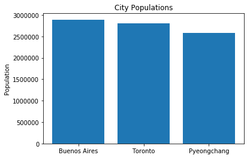

# Looping Over Collections - Lab

## Introduction
In this lab, we will be practicing what we know about for loops. We will use them to reduce the amount of code we write by hand to iterate through collections. We will use data from our excel file, `cities.xlsx`, that had data on different cities, their populations, and their areas. Finally, we will use this information to plot and compare each city. Let's get started!

## Objectives
* Use loops to iterate over a collection of records

## Identifying When To Use a For Loop

In the last lesson, we worked with some of our travel data.  Let's retrieve a list with our travel information again from excel.  First, we read the information from excel as a list of dictionaries, with each dictionary representing a location.  And we assign this list to the variable `cities`.


```python
import pandas
file_name = './cities.xlsx'
travel_df = pandas.read_excel(file_name)
cities = travel_df.to_dict('records')
```

Next, we retrieve the first three city names, stored as the `'City'` attribute of each dictionary, and `'Population'` of each of the cities.  Then we plot the names as our `x_values` and the populations as our `y_values`.

**EDITOR'S NOTE: SHOULD THIS BE MATPLOTLIB OR PLOTLY? THE README CODE USES MATPLOTLIB, BUT THE SOLUTION BRANCH USES PLOTLY**


```python
import matplotlib.pyplot as plt

%matplotlib inline

x_values = [cities[0]['City'], cities[1]['City'], cities[2]['City']]
y_values = [cities[0]['Population'], cities[1]['Population'], cities[2]['Population']]

plt.bar(x_values, y_values)
plt.ylabel('Population')
plt.title('City Populations')
 
plt.show()
```





```python
import plotly

plotly.offline.init_notebook_mode(connected=True)

x_values = [cities[0]['City'], cities[1]['City'], cities[2]['City']]
y_values = [cities[0]['Population'], cities[1]['Population'], cities[2]['Population']]
trace_first_three_pops = {'x': x_values, 'y': y_values, 'type': 'bar'}
plotly.offline.iplot([trace_first_three_pops])
```


<script>requirejs.config({paths: { 'plotly': ['https://cdn.plot.ly/plotly-latest.min']},});if(!window.Plotly) {{require(['plotly'],function(plotly) {window.Plotly=plotly;});}}</script>


<div id="e8b25897-15bf-4e93-9c28-0574e79840ae" style="height: 525px; width: 100%;" class="plotly-graph-div"></div><script type="text/javascript">require(["plotly"], function(Plotly) { window.PLOTLYENV=window.PLOTLYENV || {};window.PLOTLYENV.BASE_URL="https://plot.ly";Plotly.newPlot("e8b25897-15bf-4e93-9c28-0574e79840ae", [{"x": ["Buenos Aires", "Toronto", "Pyeongchang"], "y": [2891000, 2800000, 2581000], "type": "bar", "uid": "316e2374-e712-11e8-ab5f-6a0001a00600"}], {}, {"showLink": true, "linkText": "Export to plot.ly"})});</script>


Of course, as you may have spotted, there is a good amount of repetition in displaying this data.  Just take a look at how we retrieved the data for our `x_values` and `y_values`. And you'll notice that, unless we know the exact number of cities and populations in our excel file, this method of retrieving data might miss some data or try to access values that don't exist. 

We can take a close look at this below:


```python
x_values = [cities[0]['City'], cities[1]['City'], cities[2]['City']]
y_values = [cities[0]['Population'], cities[1]['Population'], cities[2]['Population']]
```

As we can see, if we have any more than 3 lines of data, our `x_values` and `y_values` will be incomplete, and if we had only 2 lines of data, our code would break.

So in this lesson, we will use our `for` loop to display information about our travel locations with less repetition and more accuracy.

## Instructions

Before we get into creating graphs from our cities data, let's get a bit more comfortable with the data we are working with. Let's see if we can iterate through just one element (i.e. a city **dictionary** object) to get the **area**. 


```python
buenos_aires = cities[0]
buenos_aires
```


    {'City': 'Buenos Aires',
     'Country': 'Argentina',
     'Population': 2891000,
     'Area': 4758}


```python
# here we want to find just the area of buenos_aires
buenos_aires_area = None
# code goes here
for key, value in buenos_aires.items():
    if key == "Area":
        buenos_aires_area = value
buenos_aires_area
```


    4758


Now that we have a bit more familiarity with our dictionaries, we can move on to gathering all the information we need to create our traces. 

Our `cities` list contains information about the top 12 cities.  For our upcoming iteration tasks, it will be useful to have a list of the numbers 0 through 11.  Use what we know about `len` and `range`to generate a list of numbers 1 through 11.  Assign this to a variable called `city_indices`.


```python
city_indices = list(range(0,12))
city_indices # [0, 1, 2, 3, 4, 5, 6, 7, 8, 9, 10, 11]
```


    [0, 1, 2, 3, 4, 5, 6, 7, 8, 9, 10, 11]


Now, using the `cities` list, we want to create a list of the names for each city. Loop through each city and append it's name (`'City'`) to the `city_names` list. 


```python
city_names = [city['City'] for city in cities]
city_names
```


    ['Buenos Aires',
     'Toronto',
     'Pyeongchang',
     'Marakesh',
     'Albuquerque',
     'Los Cabos',
     'Greenville',
     'Archipelago Sea',
     'Walla Walla Valley',
     'Salina Island',
     'Solta',
     'Iguazu Falls']


Your task is to assign the variable `names_and_ranks` to a list, with each element equal to the city name and it's corresponding rank.  For example, the first element would be, `"1. Buenos Aires"` and the second would be `"2. Toronto"`. Luckily for us, the list of cities that we read from our excel file is already in order my most populous to least. So, all we need to do is add numbers 1 through 12 to the beginning of each city name.

Use a `for` loop and the lists `city_indices` and `city_names` to accomplish this.  We'll need to perform some nifty string interpolation to format our strings properly.  Check out [f-string interpolation](https://www.programiz.com/python-programming/string-interpolation#f) to see how we can pass values into a string.  Remember that list indices start at zero, but we want our `names_and_ranks` list to start at one!


```python
# write a for loop that adds the properly formatted string to the names_and_ranks list

names_and_ranks = []
for (i,n) in zip(city_indices,city_names):
    names_and_ranks.append(f"{i+1}. "
                           f"{n}") #THIS IS CORRECTED. BEFORE IT WAS 'i', WHICH JUST RETURNED THE CITY_INDEX. PROBABLY CAUSING THE TEST TO FAIL
names_and_ranks

```


    ['1. Buenos Aires',
     '2. Toronto',
     '3. Pyeongchang',
     '4. Marakesh',
     '5. Albuquerque',
     '6. Los Cabos',
     '7. Greenville',
     '8. Archipelago Sea',
     '9. Walla Walla Valley',
     '10. Salina Island',
     '11. Solta',
     '12. Iguazu Falls']


```python
#IS THIS SUPPOSED TO BE HERE? ALSO, NEEDED TO ADD PRINT() TO EACH LINE TO SEE ALL 3 OUTPUTS
print (names_and_ranks[0]) # '1. Buenos Aires'
print (names_and_ranks[1]) # '2. Toronto'
print (names_and_ranks[-1]) # '12. Iguazu Falls'
```

    1. Buenos Aires
    2. Toronto
    12. Iguazu Falls


Ok, now use another for loop to iterate through our list of `cities` and create a new list called `city_populations` that had the population for each city (`Population`).


```python
# use a for loop to iterate through the list of cities with their corresponding population

city_populations = []
for city in cities:
    city_populations.append(city['Population'])
city_populations 
```


    [2891000,
     2800000,
     2581000,
     928850,
     559277,
     287651,
     84554,
     60000,
     32237,
     4000,
     1700,
     0]


```python
#IS THIS SUPPOSED TO BE HERE?
print (city_populations[0]) # 2891000
print (city_populations[1]) # 2800000
print (city_populations[-1]) # 0
```

    2891000
    2800000
    0


Great! Now we can begin to plot this data.  First, let's create a trace of our populations and set it to the variable `trace_populations`.


```python
trace_populations = {'x': names_and_ranks, 
                     'y': city_populations, 
                     'text': names_and_ranks, 
                     'type': 'bar', 
                     'name': 'Population'}
```


```python
#AGAIN, ARE WE MEANING TO USE PLOTLY HERE OR MATPLOTLIB?
import plotly
plotly.offline.init_notebook_mode(connected=True)
plotly.offline.iplot([trace_populations])
```


<script>requirejs.config({paths: { 'plotly': ['https://cdn.plot.ly/plotly-latest.min']},});if(!window.Plotly) {{require(['plotly'],function(plotly) {window.Plotly=plotly;});}}</script>


<div id="9864c2a3-3656-4672-85db-6ff384417aac" style="height: 525px; width: 100%;" class="plotly-graph-div"></div><script type="text/javascript">require(["plotly"], function(Plotly) { window.PLOTLYENV=window.PLOTLYENV || {};window.PLOTLYENV.BASE_URL="https://plot.ly";Plotly.newPlot("9864c2a3-3656-4672-85db-6ff384417aac", [{"name": "Population", "text": ["1. Buenos Aires", "2. Toronto", "3. Pyeongchang", "4. Marakesh", "5. Albuquerque", "6. Los Cabos", "7. Greenville", "8. Archipelago Sea", "9. Walla Walla Valley", "10. Salina Island", "11. Solta", "12. Iguazu Falls"], "x": ["1. Buenos Aires", "2. Toronto", "3. Pyeongchang", "4. Marakesh", "5. Albuquerque", "6. Los Cabos", "7. Greenville", "8. Archipelago Sea", "9. Walla Walla Valley", "10. Salina Island", "11. Solta", "12. Iguazu Falls"], "y": [2891000, 2800000, 2581000, 928850, 559277, 287651, 84554, 60000, 32237, 4000, 1700, 0], "type": "bar", "uid": "7a12f922-e712-11e8-9017-6a0001a00600"}], {}, {"showLink": true, "linkText": "Export to plot.ly"})});</script>


Now we want declare a variable called `city_areas` that points to a list of all of the areas of the cities.  Let's use a `for` loop to iterate through our `cities` and have `city_areas` equal to each area of the city.  


```python
city_areas = [city['Area'] for city in cities]
city_areas
```


    [4758, 2731, 3194, 200, 491, 3750, 68, 8300, 33, 27, 59, 672]


```python
trace_areas = {'x': names_and_ranks, 'y': city_areas, 'text': names_and_ranks, 'type': 'bar', 'name': 'Area'}
```

Since there is such a disparity between the size of numbers that represent the population compared to the size of the numbers that represent the areas for each city, below, we are going to represent the population numbers in hundreds. That is, we will take each population and divide it by 100 (i.e. 5,000,000/100 = 500,000.00) This is purely for the purposes of seeing our numbers plotted. 

No need to worry about the code below, just run the following cells to see our bar graph and keep in mind that the populations all have two more zeros to their real number.


```python
altered_populations = []
for population in city_populations:
    altered_populations.append(population/100)

trace_populations = {'x': names_and_ranks, 
                     'y': altered_populations, 
                     'text': names_and_ranks, 
                     'type': 'bar', 
                     'name': 'Population'}
```


```python
#AGAIN, ARE WE MEANING TO USE PLOTLY HERE OR MATPLOTLIB?
import plotly
plotly.offline.init_notebook_mode(connected=True)
plotly.offline.iplot([trace_populations, trace_areas])
```


<script>requirejs.config({paths: { 'plotly': ['https://cdn.plot.ly/plotly-latest.min']},});if(!window.Plotly) {{require(['plotly'],function(plotly) {window.Plotly=plotly;});}}</script>


<div id="a9f77bb9-74ac-4dc0-b261-1fba3dd714ec" style="height: 525px; width: 100%;" class="plotly-graph-div"></div><script type="text/javascript">require(["plotly"], function(Plotly) { window.PLOTLYENV=window.PLOTLYENV || {};window.PLOTLYENV.BASE_URL="https://plot.ly";Plotly.newPlot("a9f77bb9-74ac-4dc0-b261-1fba3dd714ec", [{"name": "Population", "text": ["1. Buenos Aires", "2. Toronto", "3. Pyeongchang", "4. Marakesh", "5. Albuquerque", "6. Los Cabos", "7. Greenville", "8. Archipelago Sea", "9. Walla Walla Valley", "10. Salina Island", "11. Solta", "12. Iguazu Falls"], "x": ["1. Buenos Aires", "2. Toronto", "3. Pyeongchang", "4. Marakesh", "5. Albuquerque", "6. Los Cabos", "7. Greenville", "8. Archipelago Sea", "9. Walla Walla Valley", "10. Salina Island", "11. Solta", "12. Iguazu Falls"], "y": [28910.0, 28000.0, 25810.0, 9288.5, 5592.77, 2876.51, 845.54, 600.0, 322.37, 40.0, 17.0, 0.0], "type": "bar", "uid": "849763c6-e712-11e8-a67a-6a0001a00600"}, {"name": "Area", "text": ["1. Buenos Aires", "2. Toronto", "3. Pyeongchang", "4. Marakesh", "5. Albuquerque", "6. Los Cabos", "7. Greenville", "8. Archipelago Sea", "9. Walla Walla Valley", "10. Salina Island", "11. Solta", "12. Iguazu Falls"], "x": ["1. Buenos Aires", "2. Toronto", "3. Pyeongchang", "4. Marakesh", "5. Albuquerque", "6. Los Cabos", "7. Greenville", "8. Archipelago Sea", "9. Walla Walla Valley", "10. Salina Island", "11. Solta", "12. Iguazu Falls"], "y": [4758, 2731, 3194, 200, 491, 3750, 68, 8300, 33, 27, 59, 672], "type": "bar", "uid": "84976540-e712-11e8-bff2-6a0001a00600"}], {}, {"showLink": true, "linkText": "Export to plot.ly"})});</script>


### Summary

In this section we saw how we can use `for` loops to go through elements of a list and perform the same operation on each.  By using `for` loops we were able to reduce the amount of code that we wrote and while also writing more expressive code.
